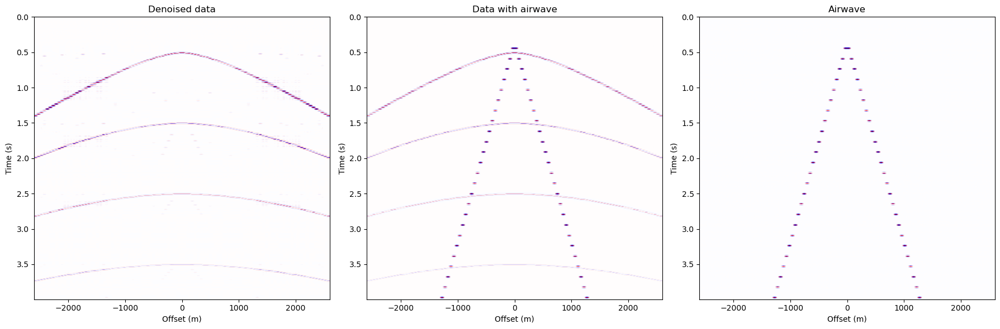
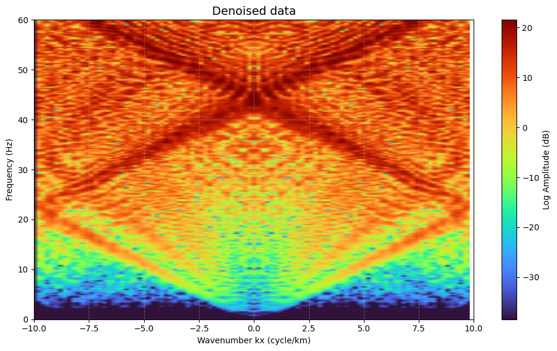
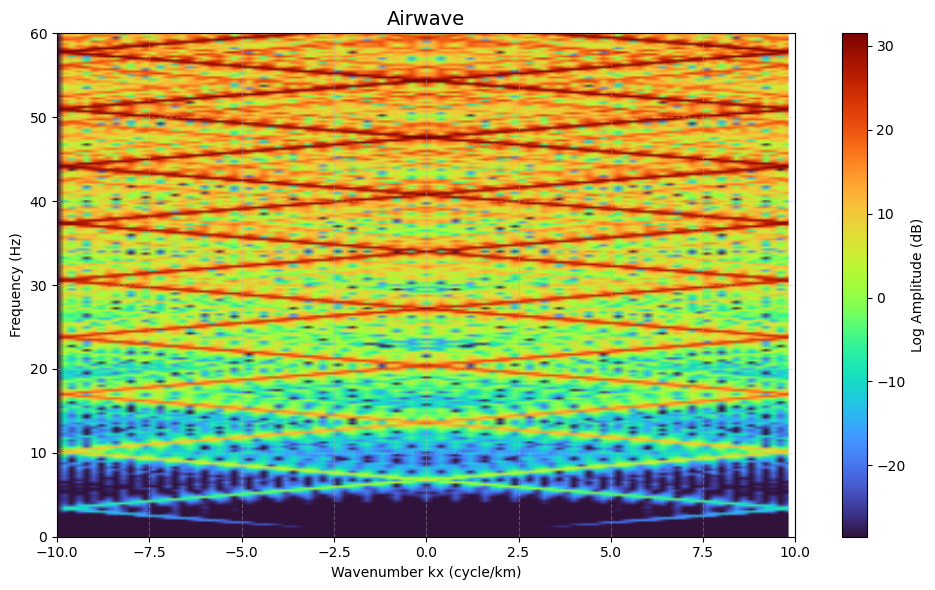

# Linear Noise Attenuation in Seismic Data using Singular Value Decomposition (SVD)

This repository implements a data-driven approach to attenuate coherent linear noise (specifically **Air Waves**) from seismic shot records using **Singular Value Decomposition (SVD)**. Unlike classical f-k filters, this method focuses on preserving the underlying hyperbolic reflections while targeting high-energy coherent noise.

Seismic sections act like an "ultrasound of the earth". However, real-world data is often contaminated with **Air Waves**—high-amplitude, low-velocity linear noise that masks valuable hyperbolic reflections. This project demonstrates:
1. Generation of a synthetic seismic shot record with primaries, multiples, and air waves.
2. Comparative analysis between classical **f-k filtering** and **SVD-based denoising**.
3. Effective separation of signal and noise subspaces.

## Singular Value Decomposition (SVD)
SVD decomposes a seismic data matrix $A$ into three matrices:

$$A = U \Sigma V^T$$

Where:
* **$U$ and $V$**: Orthogonal matrices representing the left and right singular vectors (eigenimages).
* **$\Sigma$**: A diagonal matrix containing singular values representing the energy of each component.

In seismic processing, high-energy coherent noise (like air waves) typically aligns with the first few singular values (Rank-1 approximation), allowing us to isolate the noise model and subtract it from the original data.

##  Methodology
The workflow involves the following steps:
1. **Model Definition**: Establishing earth parameters (thickness: 500m, P-wave velocities: 2-3.5 m/ms, density: 2.2-2.6 g/cm³).
2. **Synthetic Generation**: Creating a shot record with 100 stations and a Ricker wavelet (60 Hz peak frequency).
3. **SVD Application**: Applying the algorithm to the entire data matrix to estimate the air wave.
4. **Subtraction**: Removing the estimated noise model from the original record to reveal hidden reflections.

##  Key Results
### Time-Space (t-x) & f-k Domain Analysis
The SVD filter successfully attenuates the V-shaped air wave noise while maintaining the lateral continuity of hyperbolic reflections.

| Shot Records | SVD Denoised Output | Airwave output |
| :---: | :---: | :---: |
|  |  |  |

**Preservation**: Unlike f-k filters that may blur reflections at crossing points, SVD preserves the amplitude and phase of the desired signal.
* **Trace Comparison**: Single trace analysis at various offsets (200m and 400m) confirms that the air wave energy is removed without distorting the wavelet of the reflections.

## Conclusions
* **Efficiency**: SVD Rank-1 approximation is a powerful tool for targeting high-energy linear noise.
* **Clarity**: After denoising, hyperbolic reflections and multiples (1st, 2nd, and 3rd order) become clearly visible.
* **Data-Driven**: The method is adaptive and does not require a predefined velocity model for noise removal.

##  References
1. Chiu, S. K., and Howell, J. E. (2008). *Attenuation of coherent noise using localized adaptive eigenimage filter*. SEG Expanded Abstracts.
2. Porsani, M. J., et al. (2009). *Ground-roll attenuation based on SVD filtering*. SEG Technical Program Expanded Abstracts.
3. Freire, S. L. M., and Ulrych, T. J. (1988). *Application of singular value decomposition to vertical seismic profiling*. Geophysics.

---

